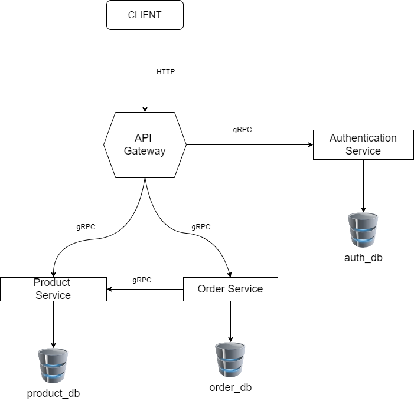

# Mircroservices Architecture 

This project demonstrates a high-level view of a microservices architecture. 
The aim is create a microservice that allows for basic crud but implemented in a microservice. 

## Architecture Diagram 

## Description 
In this project, we have multiple independent services, each performing a specific function. Theses services communicate with each other via well-defined APIs.

- **Api Gateway**: This service exposes all the internal services via REST api.
- **Authentication Service** - This services manages credentials necessary to access the secured api endpoints. 
- **Order Service** - This service handlers all order requests. 
- **Product Service** - This services manages all products in the system.

## Benefits of Microservice 

#### Microservices Architecture provides several benefits: 

- **Scalability**: Each microservice can be scaled independently.
- **Resilience**: Failure in one service does not impact the others.
- **Faster Deployment**: Smaller codebases allow for quicker changes and deployments.

#### Disadvantages of Microservices

While microservices offer several benefits, they also come with their own set of challenges:

- **Complexity**: Microservices can add complexity to your project, as you need to manage multiple services, each with its own database and potentially its own programming language.

- **Data Consistency**: Maintaining data consistency across services can be challenging, as each service has its own database.

- **Network Latency**: Communication between services can introduce network latency, potentially affecting performance.

- **Operational Overhead**: Microservices require more operational overhead. You need to handle service discovery, distributed logging, and tracing.

- **Deployment Challenges**: Coordinating deployments across multiple services can be complex.

- **Service Interdependencies**: Changes in one service might require changes in another, leading to a ripple effect.

It's important to weigh these potential disadvantages against the benefits when deciding to use a microservices architecture.
